<div align="center">

<br/>

```
███████╗██╗███████╗███████╗ █████╗ 
██╔════╝██║██╔════╝██╔════╝██╔══██╗
█████╗  ██║███████╗███████╗███████║
██╔══╝  ██║╚════██║╚════██║██╔══██║
███████╗██║███████║███████║██║  ██║
╚══════╝╚═╝╚══════╝╚══════╝╚═╝  ╚═╝
```

**A full-stack luxury e-commerce platform built with React, Node.js, MongoDB, Redis & Stripe platform with production-grade AWS infrastructure.**

<br/>

[](https://react.dev)
[](https://vitejs.dev)
[](https://nodejs.org)
[](https://expressjs.com)
[](https://mongodb.com)
[](https://redis.io)
[](https://stripe.com)
[](https://docker.com)
[](https://typescriptlang.org)
[](https://tailwindcss.com)

<br/>


---


</div>

---

## Table of Contents

- [](#)
- [Table of Contents](#table-of-contents)
- [🛍️ Overview](#️-overview)
- [✨ Features](#-features)
  - [Storefront](#storefront)
  - [Authentication](#authentication)
  - [Checkout \& Payments](#checkout--payments)
  - [Performance](#performance)
  - [Infrastructure \& DevOps](#infrastructure--devops)
- [🛠️ Tech Stack](#️-tech-stack)
  - [Frontend](#frontend)
  - [Backend](#backend)
  - [Infrastructure \& DevOps](#infrastructure--devops-1)
- [📁 Project Structure](#-project-structure)
- [🏗️ Architecture](#️-architecture)
- [🚀 Getting Started](#-getting-started)
  - [Prerequisites](#prerequisites)
  - [Local Development](#local-development)
  - [Docker Setup](#docker-setup)
- [🔑 Environment Variables](#-environment-variables)
- [📡 API Reference](#-api-reference)
  - [Auth — `/api/auth`](#auth--apiauth)
  - [Products — `/api/products`](#products--apiproducts)
  - [Cart — `/api/cart`](#cart--apicart)
  - [Payment — `/api/payment`](#payment--apipayment)
  - [Health — `/api/health`](#health--apihealth)
- [📱 Frontend Pages \& Components](#-frontend-pages--components)
  - [Pages](#pages)
  - [Shared Components](#shared-components)
- [🗃️ State Management](#️-state-management)
- [🗄️ Database Schema](#️-database-schema)
  - [User](#user)
  - [Product](#product)
  - [Order](#order)
  - [Coupon](#coupon)
- [🔐 Authentication Flow](#-authentication-flow)
- [💳 Payment Flow](#-payment-flow)
- [🏗️ Infrastructure](#️-infrastructure)
  - [AWS Architecture](#aws-architecture)
  - [Terraform Modules](#terraform-modules)
  - [Deploying to AWS](#deploying-to-aws)
- [🔄 CI/CD Pipeline](#-cicd-pipeline)
  - [Trigger rules](#trigger-rules)
  - [Authentication](#authentication-1)
  - [Required GitHub secrets](#required-github-secrets)
- [🤖 Ansible Playbooks](#-ansible-playbooks)
- [💰 Costs](#-costs)
- [📜 Scripts](#-scripts)
  - [Backend](#backend-1)
  - [Frontend](#frontend-1)
  - [Docker](#docker)
  - [Terraform](#terraform)

---

## 🛍️ Overview

**Eissa** is a production-ready luxury fashion e-commerce application. It covers the complete shopping experience — from browsing paginated product collections and filtering by category, through a Stripe-hosted checkout, order creation, and post-purchase confirmation — and is backed by a full AWS 3-tier infrastructure provisioned entirely with Terraform, operated with Ansible, and deployed automatically via GitHub Actions CI/CD.

---

## ✨ Features

### Storefront
- 🏠 **Home page** — animated hero, scrolling marquee, category grid, featured products, editorial split panels
- 🗂️ **Product catalogue** — server-side paginated grid, URL-driven page state (`?page=N`)
- 🔍 **Category filtering** — dedicated pages per category with independent pagination
- 📄 **Product detail** — thumbnail gallery, accordion details section, recommended products
- 🛒 **Cart drawer** — slide-in panel with quantity controls, free-shipping progress bar, real-time totals
- 🦴 **Skeleton loaders** — 12 shimmer skeletons matching every loading state, zero layout shift

### Authentication
- 🔐 **JWT auth** — 15-minute access tokens + 7-day refresh tokens
- 🍪 **httpOnly cookies** — XSS-safe, automatic silent refresh via Axios interceptor
- 🗄️ **Redis session store** — refresh tokens stored server-side for instant revocation

### Checkout & Payments
- 💳 **Stripe hosted checkout** — PCI-compliant, card data never touches your server
- 🎟️ **Coupon codes** — percentage-discount coupons, per-user single-use enforcement
- 🎁 **Auto-generated coupons** — orders over $200 generate a 10% gift coupon automatically
- ✅ **Order confirmation** — verifies Stripe session, creates order, deactivates used coupon

### Performance
- ⚡ **Redis caching** — featured products cached to avoid repeated DB queries
- 📦 **Server-side pagination** — parallel `skip/limit` + count query
- 🖼️ **Cloudinary** — image hosting and optimisation

### Infrastructure & DevOps
- 🏗️ **Terraform** — 11 modules covering the entire AWS stack (VPC, ECS, ALB, DocumentDB, ElastiCache, ECR, CloudFront, Route 53, ACM, WAF, IAM)
- 🤖 **Ansible** — 4 playbooks (deploy, rollback, seed-db, health-check), 2 roles (ecs-deploy, smoke-test)
- 🚀 **GitHub Actions** — 3 workflows (frontend, backend, terraform) with OIDC — no stored AWS keys
- 🐳 **Docker Compose** — single command spins up all 4 services locally
- 🏥 **Health checks** — Docker + AWS ALB health checks on every service
- 🔒 **WAF + Shield** — OWASP managed ruleset, rate limiting, IP reputation blocking
- 📊 **CloudWatch** — Container Insights, alarms for 5xx rate, ECS CPU, DB connections, cost budget

---

## 🛠️ Tech Stack

### Frontend
| Technology | Version | Purpose |
|---|---|---|
| React | 18 | UI framework |
| Vite | 5 | Build tool & dev server |
| TypeScript | 5 | Type safety |
| Tailwind CSS | 3 | Utility-first styling |
| shadcn/ui | latest | Accessible component primitives |
| Zustand | 4 | Global state management |
| React Router | 6 | Client-side routing |
| Axios | 1 | HTTP client with interceptors |
| Lucide React | latest | Icon library |

### Backend
| Technology | Version | Purpose |
|---|---|---|
| Node.js | 20 | Runtime |
| Express | 4 | HTTP framework |
| MongoDB | 7 | Primary database |
| Mongoose | 8 | ODM |
| Redis | 7 | Token store & caching |
| ioredis | 5 | Redis client |
| jsonwebtoken | latest | Authentication |
| bcryptjs | latest | Password hashing |
| Stripe Node SDK | latest | Payment processing |
| Cloudinary SDK | latest | Image hosting |

### Infrastructure & DevOps
| Technology | Version | Purpose |
|---|---|---|
| Terraform | ≥ 1.7 | Infrastructure as Code |
| Ansible | ≥ 2.16 | Configuration management & deploy automation |
| Docker | latest | Containerisation |
| Nginx | 1.27 | Reverse proxy & SPA serving |
| GitHub Actions | — | CI/CD pipeline |
| AWS ECS Fargate | — | Serverless containers |
| AWS DocumentDB | 5.0 | Managed MongoDB-compatible DB |
| AWS ElastiCache | Redis 7 | Managed Redis |
| AWS CloudFront | — | Global CDN + WAF |
| AWS ALB | — | Load balancer with TLS termination |

---

## 📁 Project Structure

```
Eissa/
│
├── docker-compose.yml              # Local: frontend + backend + mongo + redis                   # Step-by-step deployment commands
├── COST.md                         # Detailed AWS cost breakdown & optimisation guide
│
├── frontend/                       # React / Vite / TypeScript
│   ├── frontend.Dockerfile         # Multi-stage: Node builder → Nginx
│   ├── nginx.conf                  # SPA routing + /api/* proxy
│   ├── vite.config.ts
│   ├── tailwind.config.ts
│   └── src/
│       ├── pages/                  # 8 route-level components
│       │   ├── HomePage.tsx
│       │   ├── ProductsPage.tsx    # AllProductsPage + CategoryPage
│       │   ├── ProductDetailPage.tsx
│       │   ├── SignInPage.tsx
│       │   ├── SignUpPage.tsx
│       │   ├── CheckoutPage.tsx
│       │   ├── PurchaseSuccessPage.tsx
│       │   └── PurchaseCancelPage.tsx
│       ├── components/             # 6 shared components + 12 skeletons
│       │   ├── Navbar.tsx
│       │   ├── Footer.tsx
│       │   ├── CartDrawer.tsx
│       │   ├── AddToCartButton.tsx
│       │   ├── PaginationBar.tsx
│       │   └── Skeletons.tsx
│       └── stores/                 # 4 Zustand stores
│           ├── useAuthStore.ts     # auth + shared axios instance
│           ├── useCartStore.ts
│           ├── useProductStore.ts
│           └── usePaymentStore.ts
│
├── backend/                        # Node.js / Express
│   ├── backend.Dockerfile          # Multi-stage: deps → lean production image
│   ├── server.js                   # Express app entry point
│   ├── seed.js                     # 48 luxury mockup products seeder
│   ├── config/
│   │   ├── db.js                   # MongoDB connection
│   │   ├── redis.js                # Redis client (ioredis)
│   │   └── stripe.js               # Stripe SDK initialisation
│   ├── models/                     # 4 Mongoose models
│   │   ├── user.model.js
│   │   ├── product.model.js
│   │   ├── order.model.js
│   │   └── coupon.model.js
│   ├── controllers/                # 4 controllers
│   │   ├── auth.controller.js
│   │   ├── product.controller.js
│   │   ├── cart.controller.js
│   │   └── payment.controller.js
│   ├── routes/                     # 5 route files
│   │   ├── auth.route.js
│   │   ├── product.route.js
│   │   ├── cart.route.js
│   │   ├── payment.route.js
│   │   └── health.route.js
│   └── middleware/
│       └── auth.middleware.js      # JWT verification
│
├── infrastructure/                 # Terraform — 11 modules
│   ├── main.tf                     # Root: provider, backend, module wiring
│   ├── variables.tf
│   ├── outputs.tf
│   ├── observability.tf            # CloudWatch alarms, GuardDuty, budget
│   ├── terraform.tfvars.example
│   ├── modules/
│   │   ├── vpc/                    # VPC, 9 subnets, IGW, NAT, route tables, SGs, Flow Logs
│   │   ├── ecs/                    # Fargate cluster, task defs, services, auto-scaling
│   │   ├── alb/                    # ALB, target groups, HTTPS listener, HTTP→HTTPS redirect
│   │   ├── documentdb/             # MongoDB-compatible cluster, KMS encryption, secrets
│   │   ├── elasticache/            # Redis cluster, TLS, secrets
│   │   ├── ecr/                    # Frontend + backend image repositories
│   │   ├── cloudfront/             # CDN distribution, SPA error pages, security headers
│   │   ├── route53/                # Hosted zone, ALIAS records, health check
│   │   ├── acm/                    # Wildcard TLS cert, DNS validation
│   │   ├── waf/                    # WebACL, rate limiting, OWASP managed rules
│   │   └── iam/                    # ECS task roles, GitHub OIDC role
│   └── environments/
│       ├── production/terraform.tfvars
│       └── staging/terraform.tfvars
│
├── ansible/                        # Ansible — 4 playbooks, 2 roles
│   ├── inventory/
│   │   ├── production.yml          # localhost (ECS managed via AWS API, no SSH)
│   │   └── staging.yml
│   ├── group_vars/
│   │   ├── all.yml                 # Shared timing, retry, rollback config
│   │   └── production.yml          # Smoke test endpoints, prod overrides
│   ├── playbooks/
│   │   ├── deploy.yml              # Force ECS rolling deploy
│   │   └──  rollback.yml            # Revert to previous task definition summary
│
└── .github/
    └── workflows/
        ├── frontend.yml            
        └── backend.yml      

```

---

## 🏗️ Architecture

```
                        ┌─────────────────────────────────────┐
                        │           Internet / Users           │
                        └──────────────────┬──────────────────┘
                                           │ HTTPS
                        ┌──────────────────▼──────────────────┐
                        │    Route 53 (DNS)  +  ACM (TLS)      │
                        └──────────────────┬──────────────────┘
                                           │
                        ┌──────────────────▼──────────────────┐
                        │   CloudFront (CDN) + WAF             │
                        │   /*  cached · /api/* pass-through   │
                        └──────────────────┬──────────────────┘
                                           │ HTTPS (origin)
            ┌──────────────────────────────▼────────────────────────────┐
            │                    AWS VPC  10.0.0.0/16                    │
            │  ┌─────────────────────────────────────────────────────┐  │
            │  │ Public Subnets (AZ-a, AZ-b, AZ-c)                   │  │
            │  │  ┌─────────────────────┐   ┌──────────────────────┐ │  │
            │  │  │ Application LB      │   │ NAT Gateways (x3)    │ │  │
            │  │  │ /api/* → backend TG │   │ private → internet   │ │  │
            │  │  │ /*    → frontend TG │   └──────────────────────┘ │  │
            │  │  └──────────┬──────────┘                             │  │
            │  └─────────────┼──────────────────────────────────────┘  │
            │  ┌─────────────┼──────────────────────────────────────┐  │
            │  │ Private Subnets — ECS Fargate                        │  │
            │  │  ┌──────────▼──────────┐  ┌───────────────────────┐│  │
            │  │  │ Frontend Service     │  │ Backend Service        ││  │
            │  │  │ Nginx + Vite SPA     │  │ Node.js/Express :5000  ││  │
            │  │  │ Task AZ-a · AZ-b    │  │ Task AZ-a · AZ-b       ││  │
            │  │  │ Auto-scale CPU 70%  │  │ Auto-scale CPU 70%     ││  │
            │  │  └─────────────────────┘  └──────────┬────────────┘│  │
            │  └─────────────────────────────────────┼─────────────┘  │
            │  ┌──────────────────────────────────────▼─────────────┐  │
            │  │ DB Subnets — No internet access                      │  │
            │  │  ┌───────────────────┐  ┌──────────────┐  ┌──────┐ │  │
            │  │  │ DocumentDB        │  │ ElastiCache  │  │  S3  │ │  │
            │  │  │ Primary + Replica │  │ Redis 7      │  │      │ │  │
            │  │  │ KMS encrypted     │  │ TLS + Auth   │  │      │ │  │
            │  │  └───────────────────┘  └──────────────┘  └──────┘ │  │
            │  └─────────────────────────────────────────────────────┘  │
            └────────────────────────────────────────────────────────────┘
```

---

## 🚀 Getting Started

### Prerequisites

- Node.js ≥ 20
- Docker & Docker Compose
- AWS CLI v2 (for cloud deployment)
- Terraform ≥ 1.7 (for cloud deployment)
- Ansible ≥ 2.16 (for cloud deployment)

---

### Local Development

```bash
# 1. Clone
git clone https://github.com/mohammedeissa7/Ecommerce
cd Eissa

# 2. Environment
cp .env.example .env
# Fill in: STRIPE keys, Cloudinary creds, JWT secrets

# 3. Backend
cd backend && npm install && npm run dev   # port 5000

# 4. Frontend
cd frontend && npm install && npm run dev  # port 5173

# 5. Seed products
cd backend && node seed.js
```

---

### Docker Setup

```bash
cp .env.example .env   # fill in your values

docker compose up --build          # all 4 services
docker compose exec backend node seed.js   # seed products

open http://localhost
```

**Services:**

| Service | Port | Image |
|---|---|---|
| Frontend | `80` | Nginx + Vite build |
| Backend | `5000` | Node.js 20 Alpine |
| MongoDB | `27017` | mongo:7 |
| Redis | `6379` | redis:7-alpine |

---

## 🔑 Environment Variables

```env
# App
NODE_ENV=production

# URLs
CLIENT_URL=http://localhost
VITE_API_URL=/api

# Database
MONGO_URI=mongodb://localhost:27017/Eissa
REDIS_URL=redis://localhost:6379

# Auth — generate: node -e "console.log(require('crypto').randomBytes(64).toString('hex'))"
ACCESS_TOKEN_SECRET=your_64_char_random_secret
REFRESH_TOKEN_SECRET=your_other_64_char_random_secret

# Stripe — dashboard.stripe.com → Developers → API Keys
STRIPE_SECRET_KEY=sk_test_...
VITE_STRIPE_PUBLISHABLE_KEY=pk_test_...

# Cloudinary — cloudinary.com → Dashboard
CLOUDINARY_CLOUD_NAME=your_cloud_name
CLOUDINARY_API_KEY=your_api_key
CLOUDINARY_API_SECRET=your_api_secret
```

---

## 📡 API Reference

All endpoints are prefixed `/api`. Protected routes require a valid `accessToken` cookie.

### Auth — `/api/auth`

| Method | Endpoint | Auth | Body | Description |
|---|---|---|---|---|
| `POST` | `/signup` | ❌ | `{ name, email, password }` | Register, sets cookies |
| `POST` | `/login` | ❌ | `{ email, password }` | Sign in, sets cookies |
| `POST` | `/logout` | ✅ | — | Clears cookies + Redis token |
| `POST` | `/refresh-token` | ❌ | — | Issues new access token |

### Products — `/api/products`

| Method | Endpoint | Auth | Query | Description |
|---|---|---|---|---|
| `GET` | `/` | ❌ | `?page=1&limit=12` | Paginated list |
| `GET` | `/featured` | ❌ | — | Redis-cached featured |
| `GET` | `/recommended` | ❌ | — | 5 random products |
| `GET` | `/:id` | ❌ | — | Single product |
| `GET` | `/category/:category` | ❌ | `?page=1&limit=12` | Paginated by category |
| `POST` | `/` | ✅ Admin | `{ name, description, price, image, category }` | Create |
| `DELETE` | `/:id` | ✅ Admin | — | Delete + Cloudinary image |
| `PATCH` | `/:id/toggle-featured` | ✅ Admin | — | Toggle featured flag |

### Cart — `/api/cart`

| Method | Endpoint | Auth | Body | Description |
|---|---|---|---|---|
| `GET` | `/` | ✅ | — | Cart with product details |
| `POST` | `/` | ✅ | `{ productId }` | Add item |
| `DELETE` | `/` | ✅ | `{ productId? }` | Remove item or clear all |
| `PUT` | `/:id` | ✅ | `{ quantity }` | Update quantity (0 = remove) |

### Payment — `/api/payment`

| Method | Endpoint | Auth | Body | Description |
|---|---|---|---|---|
| `POST` | `/create-checkout-session` | ✅ | `{ products, couponCode? }` | Creates Stripe session |
| `POST` | `/checkout-success` | ✅ | `{ sessionId }` | Verifies payment, creates order |

### Health — `/api/health`

| Method | Endpoint | Auth | Description |
|---|---|---|---|
| `GET` | `/` | ❌ | Returns `{ status, mongo, redis, uptime }` |

---

## 📱 Frontend Pages & Components

### Pages

| Route | Component | Description |
|---|---|---|
| `/` | `HomePage` | Hero, marquee, categories, featured, editorial |
| `/products` | `AllProductsPage` | Paginated grid |
| `/products/category/:category` | `CategoryPage` | Category-filtered grid |
| `/products/:id` | `ProductDetailPage` | Detail + recommended |
| `/signin` | `SignInPage` | Login form |
| `/signup` | `SignUpPage` | Registration + password strength |
| `/checkout` | `CheckoutPage` | Order review + coupon + Stripe redirect |
| `/purchase-success` | `PurchaseSuccessPage` | Post-payment confirmation |
| `/purchase-cancel` | `PurchaseCancelPage` | Cancelled payment recovery |

### Shared Components

| Component | Description |
|---|---|
| `Navbar` | Sticky, scroll-aware, auth-conditional, cart badge |
| `Footer` | Newsletter, category links, social, marquee |
| `CartDrawer` | Slide-in, quantity controls, shipping progress |
| `AddToCartButton` | Two variants: full-width (detail) and icon (card) |
| `PaginationBar` | URL-driven, windowed page numbers, result count |
| `Skeletons` | 12 shimmer skeletons for every loading state |

---

## 🗃️ State Management

Four Zustand stores — `useAuthStore` also exports the shared Axios instance used by all stores.

```
useAuthStore    → user, isAuthenticated, signIn, signUp, signOut
                  + axios instance (withCredentials + 401 refresh interceptor)

useCartStore    → items, isDrawerOpen, CRUD actions, totalItems(), totalPrice()

useProductStore → products, pagination, featuredProducts, recommendedProducts

usePaymentStore → session, order, couponCode, createCheckoutSession, confirmCheckoutSuccess
```

---

## 🗄️ Database Schema

### User
```js
{ name, email, password (hashed), role, cartItems: [{ productId, quantity }] }
```

### Product
```js
{ name, description, price, image (Cloudinary URL), category, isFeatured, timestamps }
```

### Order
```js
{ user → User, products: [{ product → Product, quantity, price }], totalAmount, stripeSessionId, timestamps }
```

### Coupon
```js
{ code, discountPercentage, expirationDate, isActive, userId → User }
```

---

## 🔐 Authentication Flow

```
Sign In → generateToken(userId)
       → accessToken (JWT, 15 min, httpOnly cookie)
       → refreshToken (JWT, 7 days, httpOnly cookie)
       → Redis SET refresh_token:{userId} EX 7days

Silent refresh (Axios interceptor):
  401 response → POST /auth/refresh-token → verify JWT + Redis match
              → new accessToken cookie → retry original request
```

---

## 💳 Payment Flow

```
CheckoutPage → POST /api/payment/create-checkout-session
             → Stripe session created with success/cancel URLs
             → window.location.href = https://checkout.stripe.com/pay/{sessionId}

Stripe hosted page → payment complete
                   → redirect to /purchase-success?session_id=cs_...

PurchaseSuccessPage → POST /api/payment/checkout-success { sessionId }
                    → verify session.payment_status === "paid"
                    → deactivate coupon → create Order → clearCart
```

---

## 🏗️ Infrastructure



### AWS Architecture

3-tier architecture in AWS us-east-1:

| Tier | Subnet type | Services |
|---|---|---|
| Presentation | Public | ALB, NAT Gateways, Internet Gateway |
| Application | Private | ECS Fargate (frontend + backend), Secrets Manager |
| Data | DB (isolated) | DocumentDB, ElastiCache Redis, S3 |

CloudFront + WAF + Route 53 sit outside the VPC as global edge services.

### Terraform Modules

| Module | Creates |
|---|---|
| `vpc` | VPC, 9 subnets (3×public/private/db), IGW, NAT gateways, route tables, security groups, VPC Flow Logs |
| `ecs` | ECS Fargate cluster, frontend + backend task definitions, services, auto-scaling (CPU 70%) |
| `alb` | Application Load Balancer, target groups, HTTPS listener (TLS 1.3), HTTP→HTTPS redirect |
| `documentdb` | MongoDB-compatible cluster (primary + replica), KMS encryption, automated backups |
| `elasticache` | Redis 7 cluster, TLS, auth token, secrets |
| `ecr` | Frontend + backend image repositories, lifecycle rules, scan on push |
| `cloudfront` | CDN distribution, SPA error routing (404→index.html), security response headers |
| `route53` | Hosted zone, ALIAS records (apex + www), health check |
| `acm` | Wildcard TLS certificate, auto-DNS validation, auto-renewal |
| `waf` | WebACL, rate limiting, OWASP common rules, known bad inputs, IP reputation |
| `iam` | ECS task execution role, ECS task role, GitHub Actions OIDC role (no static keys) |

### Deploying to AWS

```bash
# 1. Bootstrap (once only — creates S3 state bucket + DynamoDB lock table)
./bootstrap.sh

# 2. Fill in production tfvars
cp infrastructure/terraform.tfvars.example infrastructure/terraform.tfvars
# Edit: domain_name, alert_email

# 3. Initialise and apply
cd infrastructure
terraform init
terraform apply -var-file=environments/production/terraform.tfvars

# 4. Push initial Docker images to ECR
aws ecr get-login-password | docker login --username AWS --password-stdin \
  $(terraform output -raw frontend_ecr_url | cut -d'/' -f1)

# 5. Seed the database
cd ../ansible
ansible-playbook playbooks/seed-db.yml -i inventory/production.yml -e "seed_mode=--fresh"
```

See `RUNBOOK.md` for the complete phase-by-phase guide with every command.

---

## 🔄 CI/CD Pipeline

### Trigger rules

| Event | Workflows triggered |
|---|---|
| PR to `main` (frontend changes) | lint, TypeScript check, Vite build, Docker build (no push) |
| PR to `main` (backend changes) | lint, tests (real MongoDB + Redis containers) |
| PR to `main` (infra changes) | terraform fmt, validate, plan (posted as PR comment) |
| Merge to `main` (frontend) | lint → build → ECR push → ECS rolling deploy → smoke test |
| Merge to `main` (backend) | lint → test → ECR push → ECS rolling deploy → Ansible health check |
| Merge to `main` (infra) | terraform apply |

### Authentication

GitHub Actions uses **OIDC** to assume an AWS IAM role. No `AWS_ACCESS_KEY_ID` or `AWS_SECRET_ACCESS_KEY` is ever stored in GitHub secrets — GitHub exchanges a short-lived JWT for a temporary AWS session.

### Required GitHub secrets

```
AWS_ACCOUNT_ID
AWS_REGION
AWS_GITHUB_ACTIONS_ROLE_ARN   ← from: terraform output github_actions_role_arn
VITE_STRIPE_PUBLISHABLE_KEY
```

---

## 🤖 Ansible Playbooks

| Playbook | Usage | Description |
|---|---|---|
| `deploy.yml` | `ansible-playbook playbooks/deploy.yml -i inventory/production.yml -e "service=backend image_tag=sha-abc"` | Force ECS rolling deploy to a specific image tag |
| `rollback.yml` | `ansible-playbook playbooks/rollback.yml -i inventory/production.yml -e "service=backend"` | Revert ECS service to previous task definition revision |
| `seed-db.yml` | `ansible-playbook playbooks/seed-db.yml -i inventory/production.yml -e "seed_mode=--fresh"` | Run `seed.js` as isolated ECS run-task with CloudWatch logs |
| `health-check.yml` | `ansible-playbook playbooks/health-check.yml -i inventory/production.yml` | Verify all endpoints + MongoDB + Redis status post-deploy |

---

## 💰 Costs

See [`COST.md`](./COST.md) for the full breakdown with per-service pricing, optimisation strategies, and scaling projections.

**Quick summary:**

| Config | Monthly cost |
|---|---|
| Production (HA, multi-AZ NAT) | ~$259/mo |
| Cost-optimised (Fargate Spot + single NAT) | ~$160/mo |
| Staging only | ~$85/mo |
| Local Docker only | $0 |

---

## 📜 Scripts

### Backend
```bash
npm run dev          # nodemon dev server (port 5000)
npm start            # production server
npm test             # run test suite
node seed.js         # seed products (skip existing)
node seed.js --fresh # drop + re-seed all 48 products
node seed.js --clear # clear only
```

### Frontend
```bash
npm run dev          # Vite dev server (port 5173)
npm run build        # production build → dist/
npm run preview      # preview the production build
npm run lint         # ESLint
```

### Docker
```bash
docker compose up --build          # build + start all services
docker compose up --build -d       # detached
docker compose down                # stop
docker compose down -v             # stop + delete all volumes (wipes DB data)
docker compose logs -f backend     # stream backend logs
docker compose exec mongo mongosh  # MongoDB shell
```

### Terraform
```bash
terraform init
terraform plan  -var-file=environments/production/terraform.tfvars
terraform apply -var-file=environments/production/terraform.tfvars
terraform destroy -var-file=environments/staging/terraform.tfvars  # teardown staging
terraform output github_actions_role_arn   # get IAM role ARN for GitHub secrets
```


---

<div align="center">

Built with care by **Eissa**

*Eissa — Dressed in Silence.*

</div>
